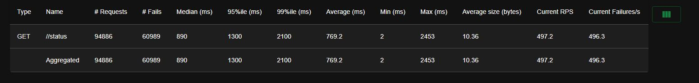
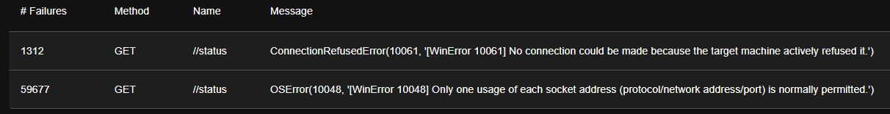
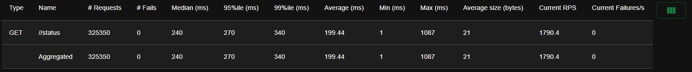
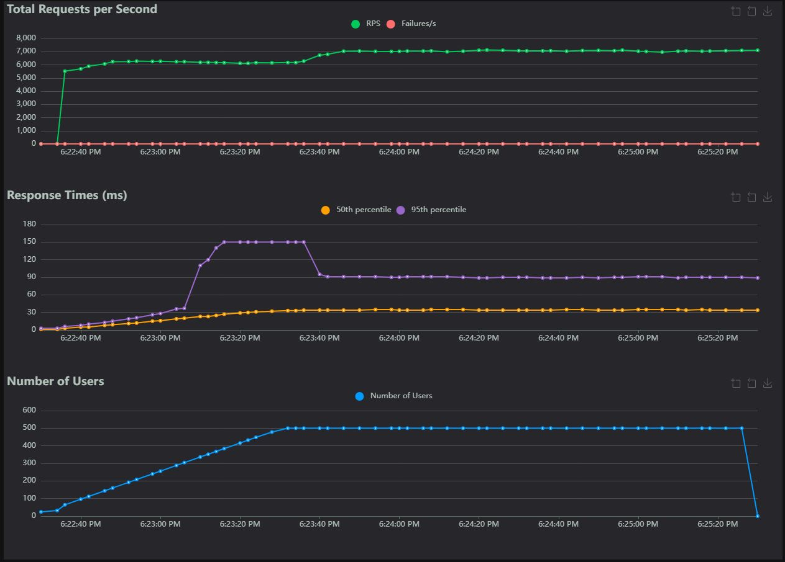
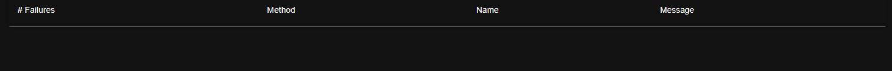

# Project

Launch `start.bat`. Start your test API, then start the locust test from the web UI.

***Note: start.bat assumes you are using a virtual environment. Adjust as needed.***

# Test parameters

See config file [locust.conf](locust-tester\locust.conf)

1. All applications running locally within a Windows environment
1. Locust will run in a single process
1. Only one test api will be running at a time, in addition to locust
1. End points are a single get method with returns a 200 status and a small json payload

# Possible issues

Locust can be distributed to additional processes to avoid issues with the python GIL. However, it does this using fork(), so it isn't supported on Windows. With that being said, both Java and Python tests will have the same test parameters, so I think this factor will not make a difference on the results.

# Results

Results were collected from VS Code 1.101 on a Windows 10 machine (Intel i9-10900KF at 3.7GHz, 32GB RAM)

Overall stats:

|API|# Requests|# Fails|Median (ms)|95%ile (ms)|99%ile (ms)|Average (ms)|Min (ms)|Max (ms)|Average size (bytes)|Current RPS|Current Failures/s|
|-|-|-|-|-|-|-|-|-|-|-|-|
|Java|325350|0|240|270|340|199.44|1|1087|21|1790.4|0|
|Python|94886|60989|890|1300|2100|769.2|2|2453|10.36|497.2|496.3|

## Flask API

#### Stats

#### Chart

#### Errors

## Java API

#### Stats

#### Chart

#### Errors
