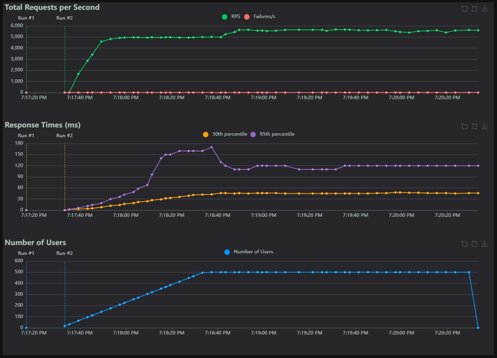
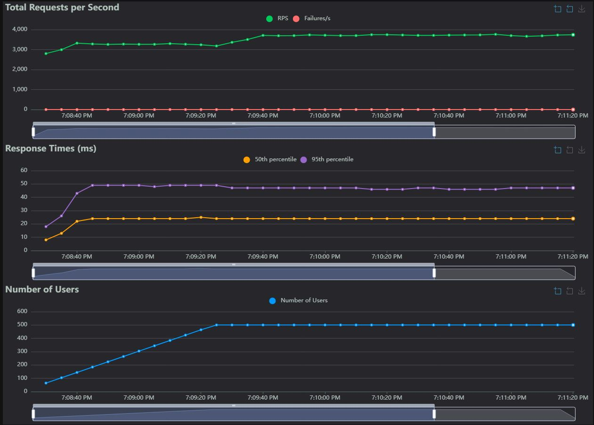

# Project

For Windows: Launch `install.bat` to set up the virtual environment and install requirements. Then start your test API and start the locust test using `start.bat`.

# Test parameters

See config file [locust.conf](locust-tester\locust.conf)

1. All applications running locally within a Windows environment
1. Locust will run with a set number of workers
1. Only one test api will be running at a time, in addition to locust
1. Each API should use a default web server worker count
1. End points are a single get method with returns a 200 status and a small json payload

# Possible issues

Locust can be distributed to additional processes or machines to avoid issues with the python GIL. If you use the `locust.conf` file to run Locust, it will create workers manually for you.

Results will be impacted by the web server implementation used to run each application (denoted in parenthesis). It is recommended to run each server with the default number of workers.

# Sample Results

Results were collected from Windows 10 with Intel i9-10900KF at 3.7GHz, 32GB RAM

Overall stats:

|API|# Requests|# Fails|Median (ms)|95%ile (ms)|99%ile (ms)|Average (ms)|Min (ms)|Max (ms)|Average size (bytes)|Current RPS|Current Failures/s|
|-|-|-|-|-|-|-|-|-|-|-|-|
|Java(Tomcat)|1212238|0|32|90|160|38.98|1|358|21|7103|0|
|Fast API(Uvicorn - ASGI)|952670|0|40|120|150|52.08|1|3236|33|5607.1|0
|Flask (Waitress - WSGI)|639903|112|24|47|55|26.69|1|4113|24|3693.4|1.2|

## Java (Tomcat)

## Fast API (Uvicorn - ASGI)

## Flask (Waitress - WSGI)

